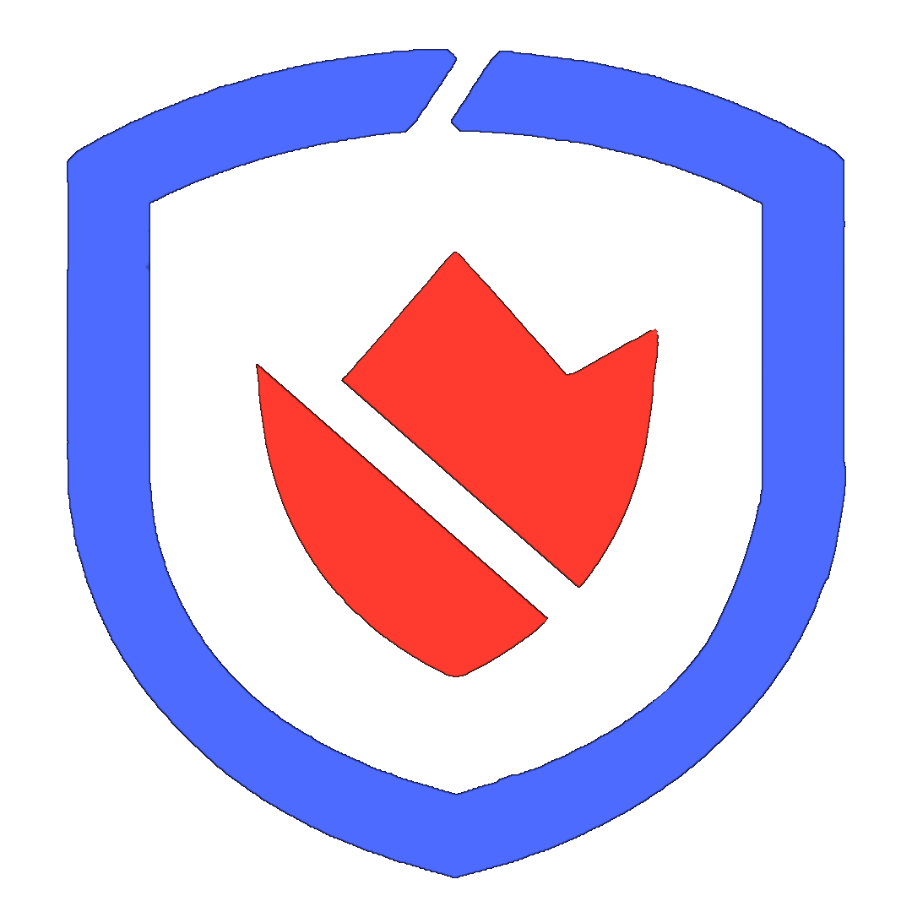
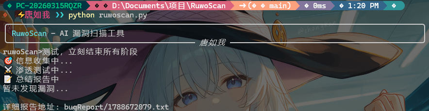
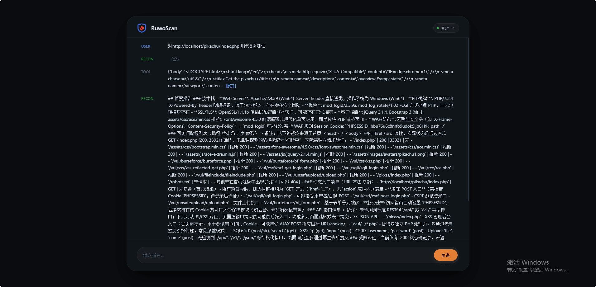

<div align="center">



# RuwoScan

> *Vulnerabilities tremble at the sight of me*

[](https://www.python.org/)
[](https://platform.openai.com)
[](https://opensource.org/licenses/MIT)
[](https://github.com/chen18924/RuwoScan)

[English](./README_EN.md) | [中文](./README.md)

</div>

---

## Table of Contents
[**`One-sentence introduction`**](#one-sentence-introduction)
[**`Features`**](#features)
[**`Quick Start`**](#quick-start)
[**`Usage`**](#usage)
[**`Project Structure & Analysis`**](#project-structure--analysis)

---

## One-sentence introduction
An automated AI vulnerability scanning tool based on an Agentic framework.

---

## Features
- **Multi-agent collaboration** Commander (sets direction), Scout (information gathering), Attacker (vulnerability testing and verification), Reporter (generates reports)
- **Complete toolchain** Equips AI with a full toolkit: file operations, HTTP requests, directory scanning, etc.
- **Phased penetration** AI penetration is phased and standardized (Reconnaissance -> Penetration -> Report generation)
- **Dynamic completion assessment** Based on attack surface coverage and vulnerability discovery, AI autonomously decides whether to proceed to the next phase
- **Python support** AI autonomously calls and runs Python programs
- **Structured reports** Automatically generates Markdown reports including vulnerability type, location, and remediation suggestions
- **Natural language** Natural language interaction, no need to remember complex commands
- **Web visualization** Simple operation, verifiable process, fully transparent
- **Low barrier to entry** No security background required, clone and use immediately
---

## Quick Start

### Installation
Three steps (copy directly)
1. Star ⭐
2. Clone the repository
3. Install dependencies

``` bash
git clone https://github.com/chen18924/RuwoScan
cd RuwoScan-main
pip install -r requirements.txt

```


### Project Configuration
The process automatically prompts for configuration; no additional setup required
``` bash
python ruwoscan.py
>> No apiKey detected, please enter: your-api-key
>> No bashUrl detected, please enter: https://....
>> No model detected, please enter: your-chat
>> File saved to config.json, keep it secure

---

## Usage
Start directly from the terminal:
``` bash
python ruwoscan.py
RuwoScan> Perform a black-box test on http://localhost/pikachu/index.php

```


Start the web interface from the terminal:
``` bash
python ruwoscan.py -web

```


---

